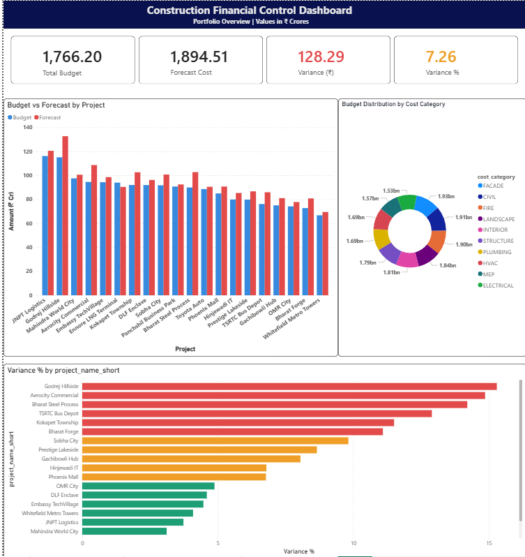
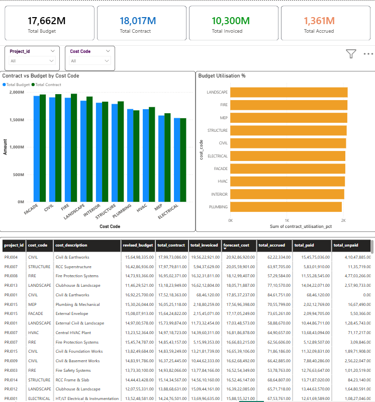
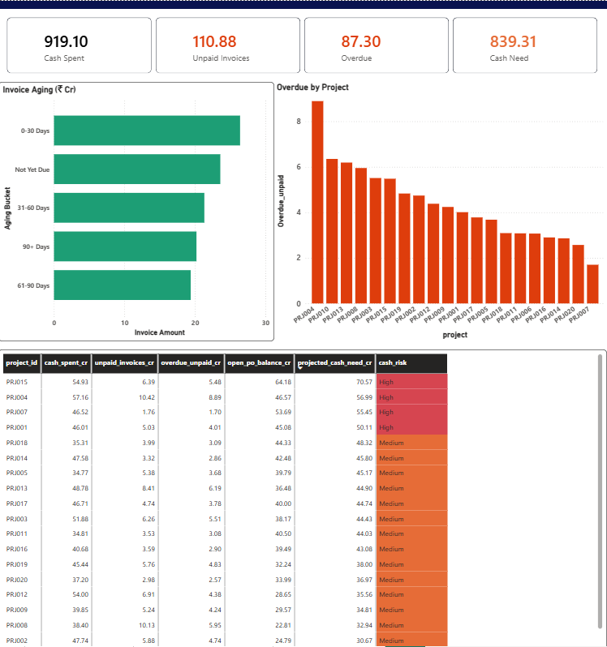
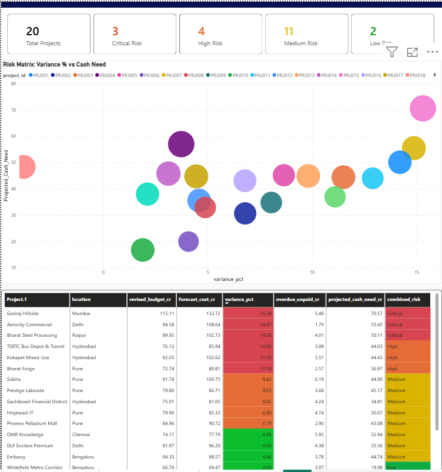

# 🏗️ Construction Financial Intelligence

> An end-to-end data engineering pipeline that transforms raw construction financial data into structured, validated, and analytics-ready datasets enabling portfolio-level cost control, financial risk detection, and cash flow visibility across multiple projects.


---

## 🎯 Objective

Construction financial data is typically fragmented across budgets, contracts, procurement, and invoicing systems with no single view of where money is going or where the risk sits.

This project aims to:

- Standardize raw financial datasets into a unified structure
- Enforce data quality through rule-based validation
- Build a single source of truth for cost tracking
- Enable reliable financial analytics and risk monitoring

---

## 🧱 Architecture

```
Raw CSV Data
    │
    ▼
Python ETL (Validation + Transformation)
    │   ├── Schema validation & type casting
    │   ├── Exception logging
    │   └── Bulk load into PostgreSQL
    │
    ▼
PostgreSQL
    │   ├── Staging Tables (stg_*)
    │   ├── Core & Aggregation Views
    │   ├── Unified Cost Model (vw_unified_cost)
    │   ├── Forecast & Cashflow Views
    │   └── Risk & Exception Views
    │
    ▼
Power BI (Read-only Consumption Layer)
    ├── Portfolio Overview
    ├── Financial Control (Cost Code Level)
    ├── Cash Flow & Invoice Aging
    └── Executive Risk Matrix
```

---

## ⚙️ Tech Stack

| Layer | Technology |
|---|---|
| ETL | Python (pandas, psycopg2) |
| Database | PostgreSQL |
| Transformation | SQL (views, aggregations) |
| Visualisation | Power BI |

---

## 📁 Project Structure

```
construction-financial-intelligence/
│
├── config.py                  # Configuration (DB, thresholds)
├── loader.py               # ETL pipeline (validate → transform → load)
├── Validator.py         # Rule-based validation engine
├── run_pipeline.py
│
├── sql/
│   ├── staging_tables.sql      # Table definitions
│   └── views.sql               # Analytical & semantic views
│
├── raw_data/                   # Input datasets (not committed)
│   ├── project_master.csv
│   ├── budget_cost_codes.csv
│   ├── vendor_contracts.csv
│   ├── purchase_orders.csv
│   ├── vendor_invoices.csv
│   └── accruals.csv
│
├── dashboards/
│   ├── screenshots/
│   └── *.pbix                  # Power BI reports
│
└── README.md
```

---

## 🔄 Data Pipeline

### 1. Data Ingestion

Six core financial datasets:

| File | Description |
|---|---|
| `project_master.csv` | Project metadata, dates, location, status |
| `budget_cost_codes.csv` | Original + revised budget per cost code |
| `vendor_contracts.csv` | Contract values and approved amendments |
| `purchase_orders.csv` | PO amounts, dates, delivery status |
| `vendor_invoices.csv` | Invoices with payment status and due dates |
| `accruals.csv` | Accrued costs with reversal schedules |

### 2. Data Validation Layer

A rule-based validation framework ensures data integrity before analysis.

Key checks include:

- Contract value exceeding budget
- PO exceeding contract value
- Invoice exceeding PO value
- Overdue unpaid invoices
- Cash exposure above thresholds
- Missing or invalid records

Outputs:
- `exceptions_summary` table in PostgreSQL
- Rule-level failure logs with exposure in ₹ Cr

### 3. Data Modeling (PostgreSQL)

**Staging Layer** — Raw structured data loaded into normalized `stg_*` tables

**Core & Aggregation Views** — Standardized financial metrics at project and cost code level

**Semantic Layer** — `vw_unified_cost` combines budget + contract + PO + invoice + accrual into a single source of truth for all downstream analysis

---

## 📊 Key Analytical Views

| View | Purpose |
|---|---|
| `vw_unified_cost` | Unified cost model across all financial layers |
| `vw_forecast_summary` | Forecast cost vs budget with variance % and cost risk |
| `vw_cashflow_projection` | Cash spent, unpaid, overdue, open PO balance, projected cash need |
| `vw_invoice_aging` | Unpaid invoices bucketed: Not Yet Due / 0-30 / 31-60 / 61-90 / 90+ days |
| `vw_portfolio_risk` | Combined cost + cash risk score per project with stress testing at +10% |

---

## 🚨 Data Quality & Risk Controls

The exception engine identifies critical financial risks across the portfolio:

| Risk Type | Flag Condition |
|---|---|
| Budget Overrun | Forecast cost > revised budget |
| Over-contracting | Contract value > budget by >20% |
| Over-invoicing | Invoice amount > PO value |
| Invoice Delay | Unpaid invoice past due date |
| High Cash Exposure | Projected cash need > ₹50 Cr |
| Accrual Inconsistency | Active accrual with no reversal date |

Risk classification per project:

- 🔴 **Critical** — Variance > 10% AND Cash Risk = High
- 🟠 **High** — Variance > 10% OR Cash Risk = High
- 🟡 **Medium** — Variance > 5% OR Cash Risk = Medium
- 🟢 **Low** — All controls within thresholds

---

## 📈 Dashboard Layer

Power BI dashboards are built on top of the semantic layer (read-only, no direct table access):

**Portfolio Overview**
- KPIs: Total Budget, Forecast Cost, Variance (₹ Cr & %)
- Budget vs Forecast by project
- Cost distribution by category (Civil, Structure, MEP, Facade, etc.)

**Financial Control**
- Filterable by Project and Cost Code
- Contract vs Budget by cost code
- Detailed cost table: budget → contract → invoiced → forecast → paid → unpaid

**Cash Flow & Invoice Aging**
- KPIs: Cash Spent, Unpaid Invoices, Overdue, Projected Cash Need
- Aging waterfall chart by bucket
- Cash risk classification table per project

**Executive Risk Matrix**
- Bubble scatter: Variance % vs Projected Cash Need
- Combined risk score per project
- Stress-tested forecast at +10% for worst-case planning

---

## 📊 Dashboard Preview






> Portfolio tracked: ₹1,766 Cr across 20 projects

---

## 💡 Key Learnings

- Designing end-to-end data pipelines for financial systems
- Implementing rule-based data quality frameworks in Python
- Building unified cost models across multiple source datasets
- Translating construction domain knowledge into structured data systems
- Separating processing logic from the visualization layer

---

## 🗺️ Roadmap

- [ ] Incremental data loading (replace full truncate + reload)
- [ ] Pipeline orchestration with Apache Airflow
- [ ] Direct ACC (Autodesk Construction Cloud) integration via APS API
- [ ] Cloud deployment (AWS RDS / GCP Cloud SQL)
- [ ] Automated PDF exception reports
- [ ] Advanced forecasting with trend-based models

---

## 👤 Author

**Darshan HS**  
Civil Engineer → Construction Data Analytics  
[LinkedIn](https://www.linkedin.com/in/darshan-hs-6725a2256) · [GitHub](https://github.com/Darshanhs022)

---

